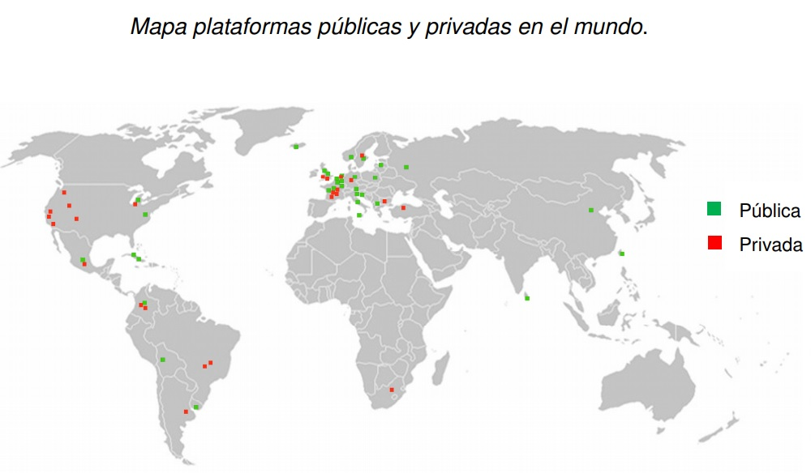
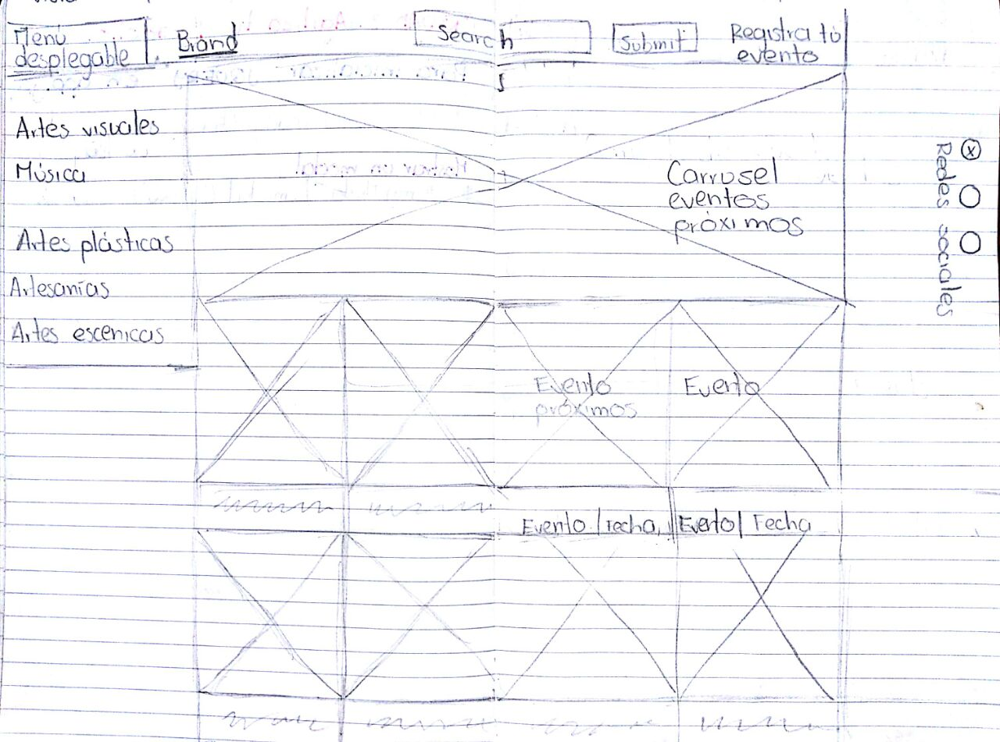
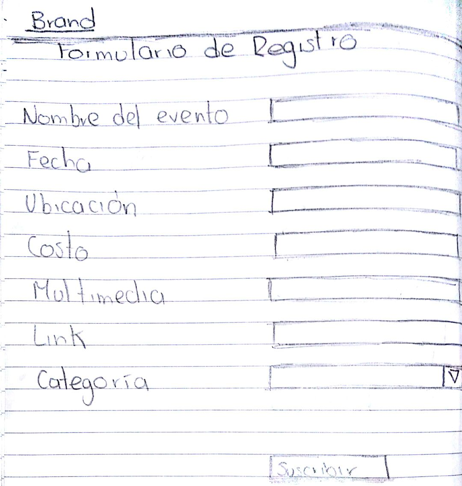
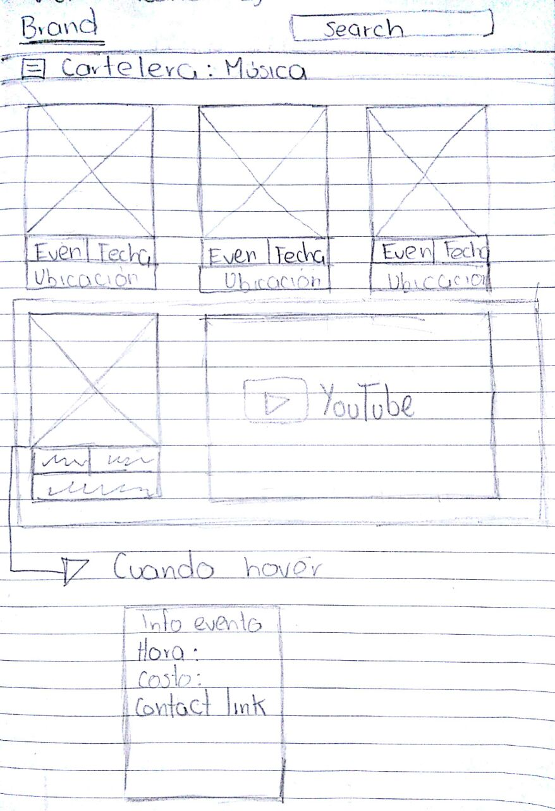

# UNDERGROUND-ARTS

Descripción: Undergound-arts será un sitio dedicado a la difusión de eventos culturales, de artistas independientes.

##_PROCESO DE DISEÑO_
Investigación: Las encuestas realizadas muestran que el 100% de los encuestados está interesado en eventos
culturales de artistas independientes, que un 33.3% de ellos accede a la información de esos eventos de boca
en boca, el 8% en sitios web y el 100% en redes sociales. Y que a un 78 % de ellos, les gustaría tener acceso
a la información de esos eventos, en un sitio web especializado.

Como se muestra en el siguiente mapa, las plataformas de difusión cultural, son poco explotadas en México.

-Necesidad: tener acceso rápido y fácil a la informacón de eventos culturales de artistas independientes,
como su ubicación, costo, fecha e incluso conocer un poco de la trayectoria del artísta.

-Objetivo: dinfundir eventos culturales de artistas independientes, mediante un sitio web en el que se presentará
la información de cada evento y artista a manera de cartelera.

## Sketch

##Colaboración de las integrantes:

_ Aide :
* Día 1. Maquetado vista 2 (formulario), investigación para implementar firebase
* Día 2. Implementación de firebase
* Día 3.Funcionalidad
* Día 4.Funcionalidad

_ Daniela:
* Día 1. Maquetado vista 3 (cartelera), investigación para implementar firebase
* Día 2. Implementación de firebase y funcionalidad
* Día 3. Funcionalidad
* Día 4. Funcionalidad

_ Ana Luisa:
* Día 1.Maquetado vista 1 (principal), investigación de la API de facebook
* Día 2.Implementación de API
* Día 3.Funcionalidad
* Día 4. Funcionalidad

_ Anett:
* Día 1.Investigación y sketch
* Día 2. Readme, agregar estilos al maquetado
* Día 3. Maquetación
* Día 4. Arreglos finales
